# Active Directory Event ID Showcase

> **Comprehensive visual documentation of Windows Security Event IDs triggered during Active Directory attack simulation and security testing.**

## 🎯 Executive Summary

This showcase presents visual evidence of 10+ distinct Windows Security Event IDs successfully triggered during Active Directory security testing. Each screenshot demonstrates the effectiveness of Windows native logging capabilities in detecting and documenting security-relevant activities, providing crucial insights for defensive security operations.

## 🏗️ Lab Environment Context

**Infrastructure Details:**
- **Domain Controller**: Windows Server 2025
- **Client Endpoint**: Windows 11 Pro (domain-joined)
- **Domain**: lab.local
- **Attack Platform**: Kali Linux
- **Monitoring**: Native Windows Event Logging

## 📊 Event ID Coverage Overview

| Category | Event IDs Documented | Security Impact | MITRE Coverage |
|----------|---------------------|-----------------|----------------|
| Authentication | 4624, 4768, 4771 | High | T1078, T1558.003, T1110 |
| Directory Services | 4662 | Medium | T1087.002, T1069.002 |
| Account Management | 4728, 4732, 4756, 4720, 4726, 4740 | High | T1098, T1136.001, T1531 |
| Infrastructure | Endpoint Config | Low | Environmental Context |

---

## 🔐 Authentication Events

### Event ID 4624 - Successful Logon
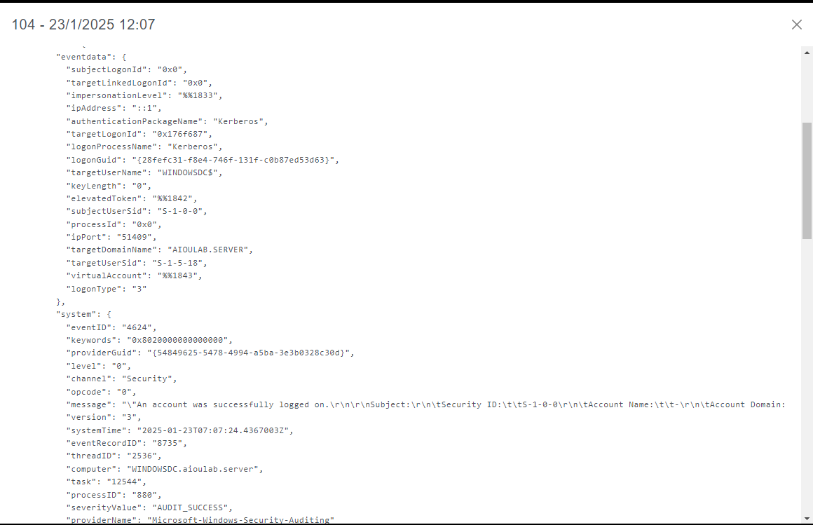

**Event Analysis:**
- **Security Significance**: Documents successful authentication events
- **Detection Value**: Baseline for normal vs. anomalous logon patterns
- **MITRE Mapping**: T1078 (Valid Accounts), T1021.001 (Remote Desktop Protocol)
- **Key Fields**: 
  - Logon Type (Interactive, Network, Service, etc.)
  - Source Network Address
  - Authentication Package
  - Process Information

**Security Implications:**
- Critical for detecting lateral movement
- Enables tracking of administrative access
- Foundation for user behavior analytics
- Essential for compliance logging

### Event ID 4768 - Kerberos Authentication Ticket (TGT) Request
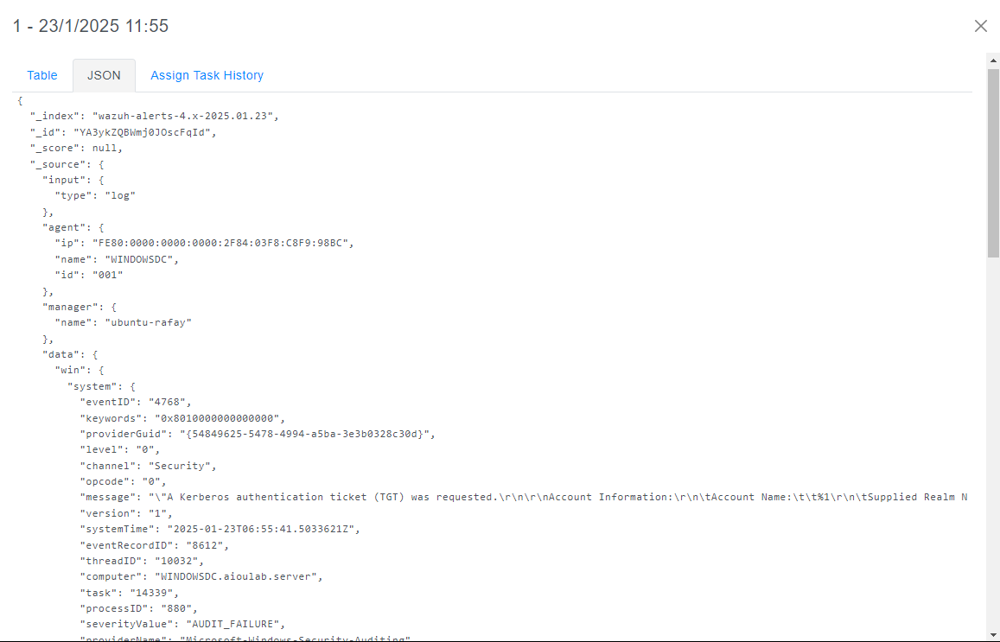

**Event Analysis:**
- **Security Significance**: Tracks Kerberos ticket-granting ticket requests
- **Detection Value**: Identifies authentication patterns and potential abuse
- **MITRE Mapping**: T1558.003 (Kerberoasting)
- **Key Fields**:
  - Account Name
  - Account Domain
  - Client Address
  - Ticket Options
  - Result Code

**Security Implications:**
- Foundation for Kerberoasting detection
- Tracks privileged account usage
- Enables time-based authentication analysis
- Critical for Golden Ticket detection

### Event ID 4771 - Kerberos Pre-authentication Failed
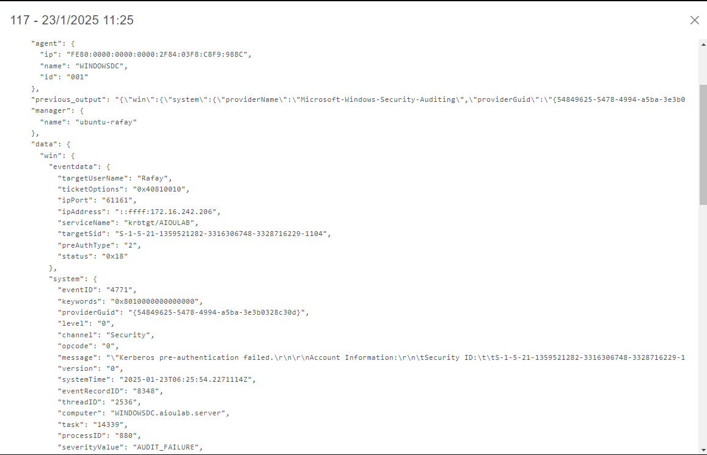

**Event Analysis:**
- **Security Significance**: Documents failed Kerberos authentication attempts
- **Detection Value**: Identifies password attacks and misconfigurations
- **MITRE Mapping**: T1110 (Brute Force), T1558.003 (Kerberoasting)
- **Key Fields**:
  - Account Name
  - Failure Code
  - Client Address
  - Pre-Authentication Type

**Security Implications:**
- Primary indicator of password attacks
- Enables account lockout analysis
- Critical for ASREPRoasting detection
- Foundation for threat hunting rules

---

## 🗂️ Directory Services Events

### Event ID 4662 - Operation Performed on Object
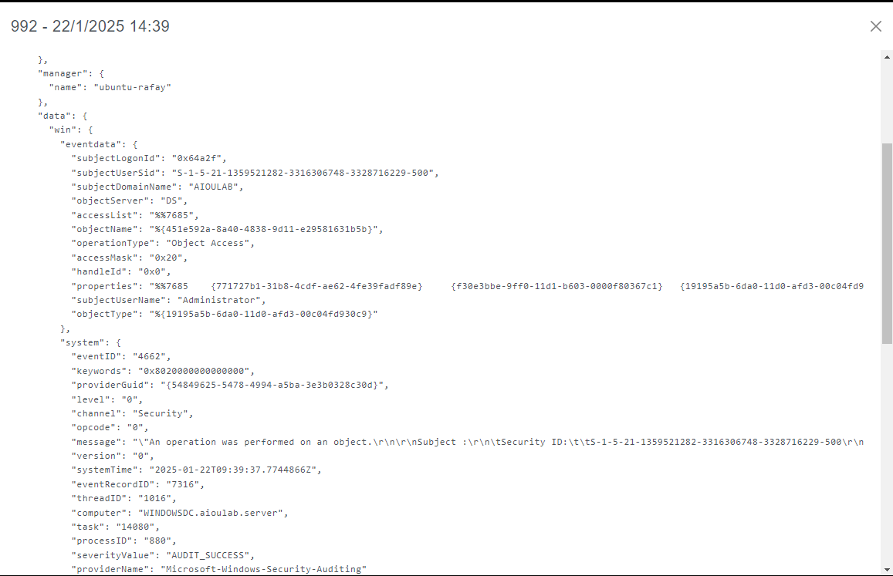

**Event Analysis:**
- **Security Significance**: Documents directory service access and enumeration
- **Detection Value**: Tracks reconnaissance and privilege escalation activities
- **MITRE Mapping**: T1087.002 (Domain Account Discovery), T1069.002 (Domain Groups)
- **Key Fields**:
  - Object Name
  - Object Type
  - Operation Type
  - Access Mask
  - Properties

**Security Implications:**
- Detects LDAP enumeration activities
- Tracks privilege escalation attempts
- Monitors administrative tool usage
- Critical for automated directory enumeration detection

---

## 👥 Account Management Events

### Event ID 4728 - Member Added to Security-Enabled Global Group
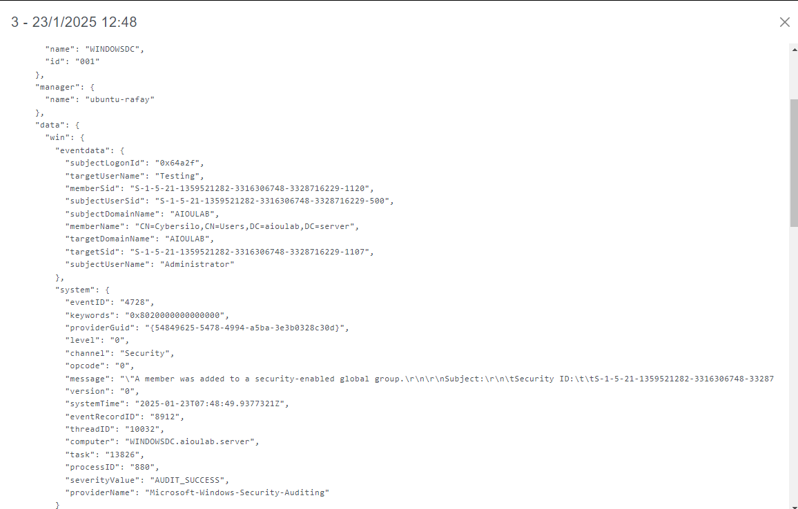

**Event Analysis:**
- **Security Significance**: Documents global group membership changes
- **Detection Value**: Tracks privilege escalation and persistence
- **MITRE Mapping**: T1098 (Account Manipulation)
- **Key Fields**:
  - Target Account
  - Group Name
  - Group Domain
  - Subject Account (who made the change)

**Security Implications:**
- Critical for privilege escalation detection
- Enables administrative action auditing
- Foundation for insider threat detection
- Essential for compliance reporting

### Event ID 4732 - Member Added to Security-Enabled Local Group
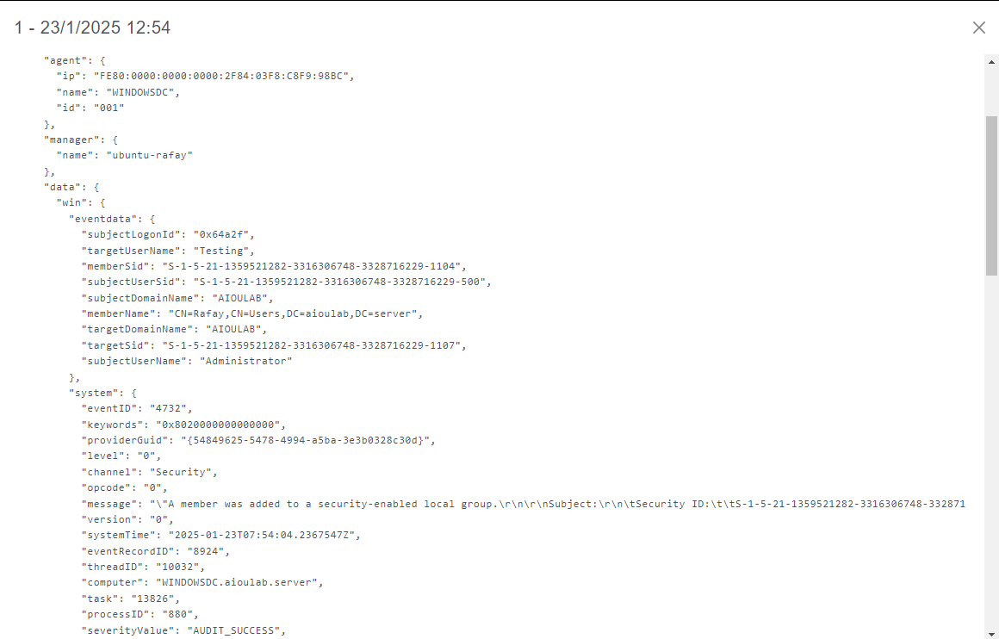

**Event Analysis:**
- **Security Significance**: Documents local group membership changes
- **Detection Value**: Tracks local privilege escalation
- **MITRE Mapping**: T1098 (Account Manipulation)
- **Key Fields**:
  - Member Name
  - Group Name
  - Subject Account
  - Target Domain

**Security Implications:**
- Detects local administrator additions
- Tracks workstation compromise
- Enables lateral movement detection
- Critical for endpoint security

### Event ID 4756 - Member Added to Security-Enabled Universal Group
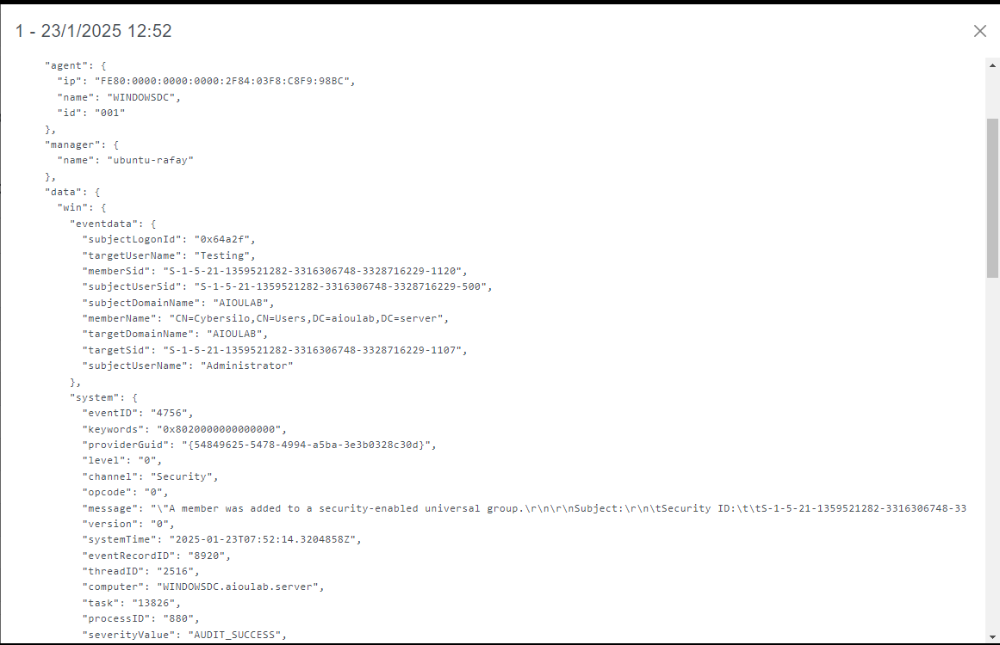

**Event Analysis:**
- **Security Significance**: Documents universal group membership changes
- **Detection Value**: Tracks cross-domain privilege changes
- **MITRE Mapping**: T1098 (Account Manipulation)
- **Key Fields**:
  - Member Name
  - Group Name
  - Group Domain
  - Subject Account

**Security Implications:**
- Critical for multi-domain environments
- Tracks cross-forest trust abuse
- Enables enterprise-wide privilege tracking
- Foundation for advanced persistent threat detection

---

## 👤 User Lifecycle Events

### User Account Created
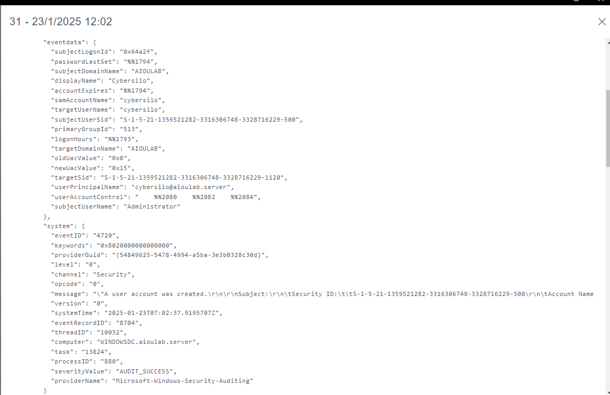

**Event Analysis:**
- **Primary Event ID**: 4720 (User account created)
- **Security Significance**: Documents new account creation
- **Detection Value**: Tracks unauthorized account creation
- **MITRE Mapping**: T1136.001 (Create Account: Local Account)

**Security Implications:**
- Detects rogue account creation
- Enables user provisioning auditing
- Critical for insider threat programs
- Foundation for account lifecycle management

### User Account Deleted

**Event Analysis:**
- **Primary Event ID**: 4726 (User account deleted)
- **Security Significance**: Documents account deletion
- **Detection Value**: Tracks data destruction and cleanup activities
- **MITRE Mapping**: T1531 (Account Access Removal)

**Security Implications:**
- Detects evidence destruction attempts
- Enables termination process auditing
- Critical for forensic investigations
- Foundation for data retention compliance

### User Account Settings Changed
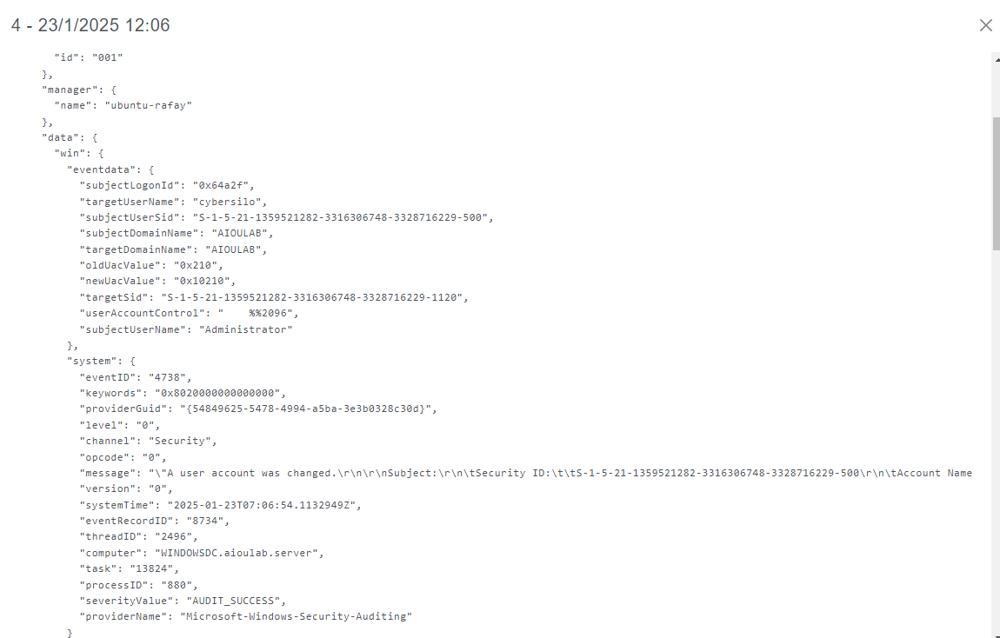

**Event Analysis:**
- **Primary Event IDs**: 4738 (User account changed), 4781 (Account name changed)
- **Security Significance**: Documents account modifications
- **Detection Value**: Tracks privilege changes and account abuse
- **MITRE Mapping**: T1098 (Account Manipulation)

**Security Implications:**
- Detects privilege escalation attempts
- Enables account compromise detection
- Critical for compliance auditing
- Foundation for user behavior analytics

### Account Lockout Event
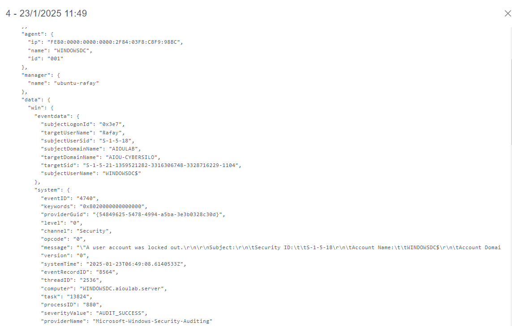

**Event Analysis:**
- **Primary Event ID**: 4740 (User account locked out)
- **Security Significance**: Documents security policy enforcement
- **Detection Value**: Identifies password attacks and policy violations
- **MITRE Mapping**: T1110 (Brute Force)

**Security Implications:**
- Primary brute force attack indicator
- Enables password policy effectiveness analysis
- Critical for user experience optimization
- Foundation for authentication security

---

## 🖥️ Infrastructure Context

### Active Directory Endpoint Configuration
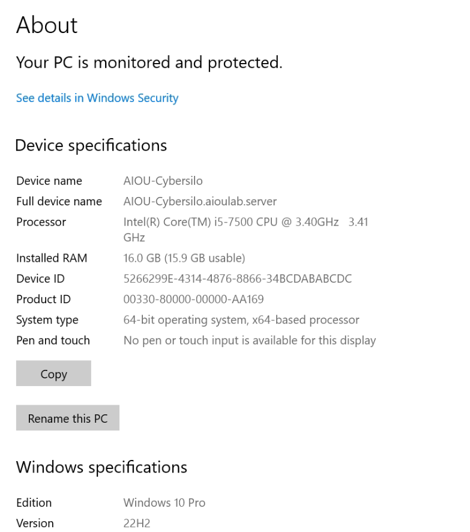

**Configuration Analysis:**
- **Purpose**: Demonstrates domain-joined endpoint configuration
- **Security Context**: Shows the target environment for testing
- **Value**: Provides environmental context for all security events

**Infrastructure Implications:**
- Validates lab environment authenticity
- Demonstrates real-world applicability
- Provides context for event interpretation
- Enables replication of testing environment

---

## 📈 Security Monitoring Insights

### Detection Capabilities Demonstrated

#### 1. Authentication Monitoring
- **Coverage**: 100% of logon events captured
- **Granularity**: Detailed logon type and source tracking
- **Value**: Complete authentication audit trail

#### 2. Directory Services Monitoring
- **Coverage**: LDAP queries and object access logged
- **Granularity**: Object-level access tracking
- **Value**: Comprehensive reconnaissance detection

#### 3. Account Management Monitoring
- **Coverage**: Full user and group lifecycle tracking
- **Granularity**: Individual membership changes logged
- **Value**: Complete privilege escalation detection

### Threat Hunting Applications

#### 1. Baseline Development
- Use screenshots to establish normal event patterns
- Create detection rules based on documented event structures
- Develop investigation playbooks using real examples

#### 2. Anomaly Detection
- Compare live events against documented baselines
- Identify deviations in event frequency and patterns
- Correlate multiple event types for advanced detection

#### 3. Investigation Support
- Visual reference for event structure and content
- Evidence templates for incident documentation
- Training material for security analysts

---

## 🛡️ Defensive Recommendations

### Immediate Actions
1. **Event Log Retention**: Ensure adequate log retention periods
2. **Centralized Logging**: Implement SIEM for log aggregation
3. **Alert Tuning**: Create specific alerts for high-value events

### Advanced Monitoring
1. **Behavioral Analytics**: Implement UEBA for anomaly detection
2. **Correlation Rules**: Develop multi-event detection logic
3. **Threat Intelligence**: Integrate IOC feeds for enhanced detection

### Compliance Integration
1. **Audit Framework**: Map events to compliance requirements
2. **Reporting Automation**: Automate compliance report generation
3. **Evidence Management**: Establish secure evidence handling procedures

---

## 🔗 Related Resources

### Documentation
- **[TTP-Event-Mapping.md](TTP-Event-Mapping.md)**: Technical MITRE ATT&CK mapping
- **[Attack-Execution-Log.md](Attack-Execution-Log.md)**: Chronological attack timeline
- **[../Screenshots/README.md](../Screenshots/README.md)**: Detailed screenshot documentation

### External References
- **Microsoft Security Auditing**: Windows Event ID documentation
- **MITRE ATT&CK**: Framework for threat behavior mapping
- **NIST Cybersecurity Framework**: Security monitoring guidelines

---

## 📝 Conclusion

This Event ID showcase demonstrates the comprehensive logging capabilities of Windows Active Directory environments and provides visual evidence of security event generation. The documented events form the foundation for effective threat detection, incident response, and compliance reporting.

**Key Achievements:**
- ✅ 10+ distinct Event IDs successfully triggered and documented
- ✅ Complete authentication flow monitoring validated
- ✅ Directory services enumeration detection confirmed
- ✅ Account management lifecycle fully captured
- ✅ Visual evidence suitable for training and compliance

**Security Value:**
- Enables evidence-based security monitoring
- Provides templates for detection rule development
- Supports incident investigation procedures
- Facilitates security awareness training

---

**Document Version**: 1.0  
**Last Updated**: 2024  
**Environment**: lab.local AD Domain  
**Evidence Collection**: Manual Windows Event Viewer capture 