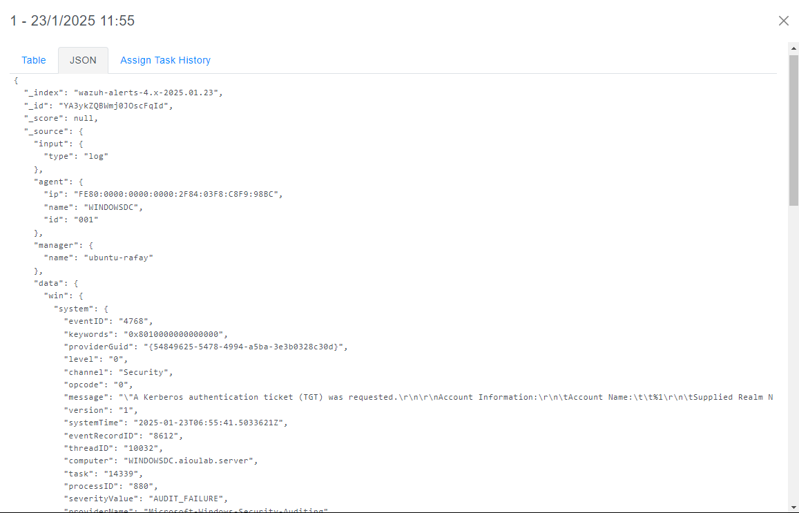
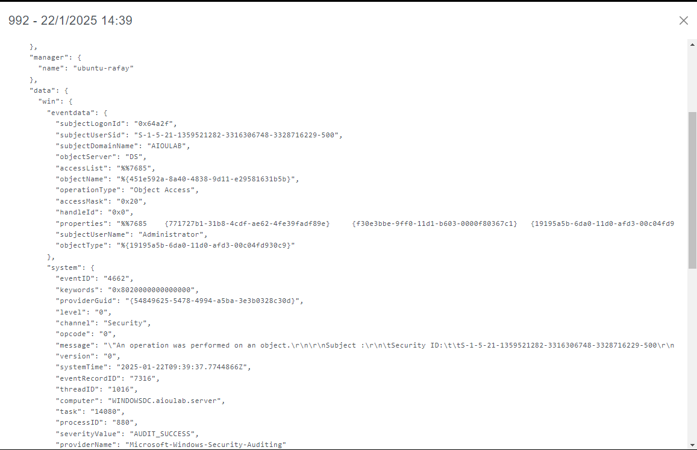
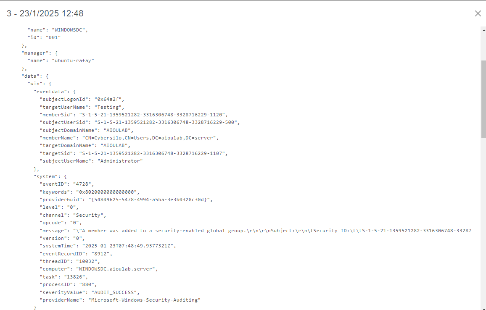
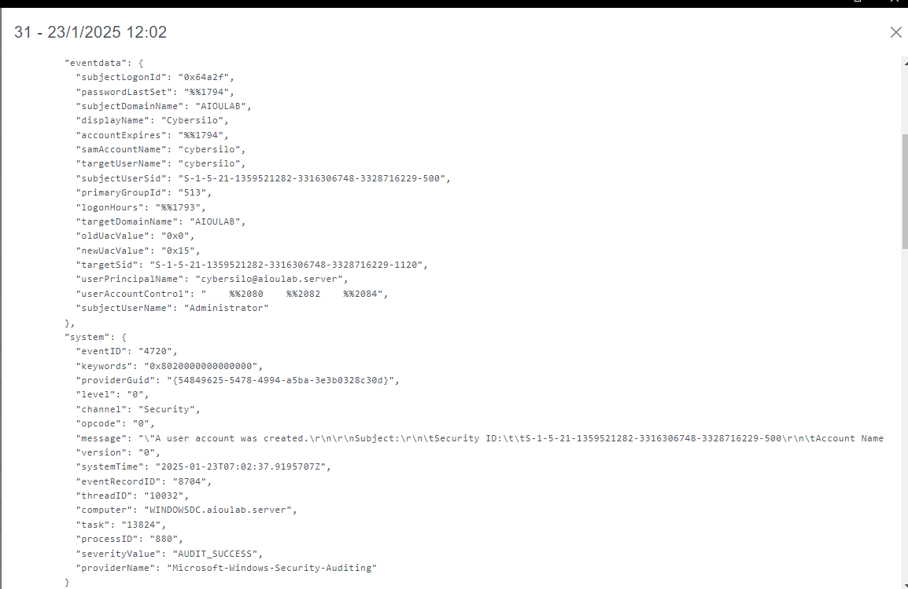
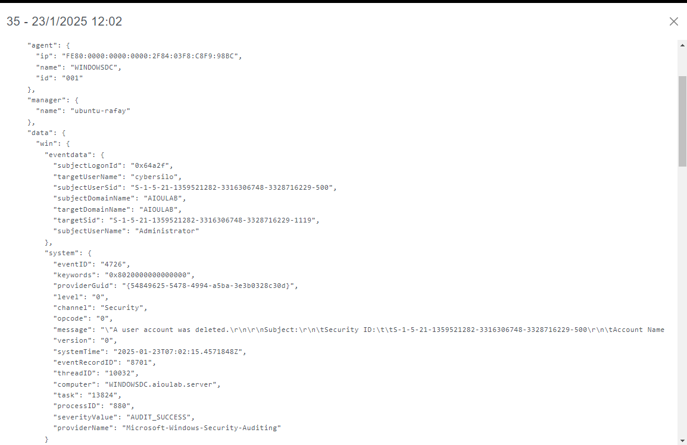
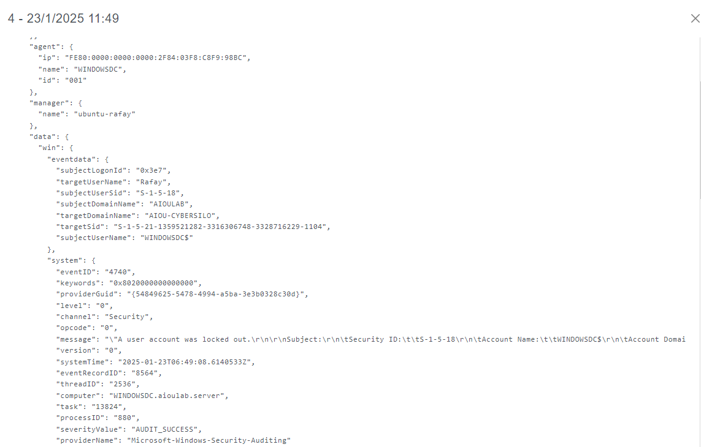
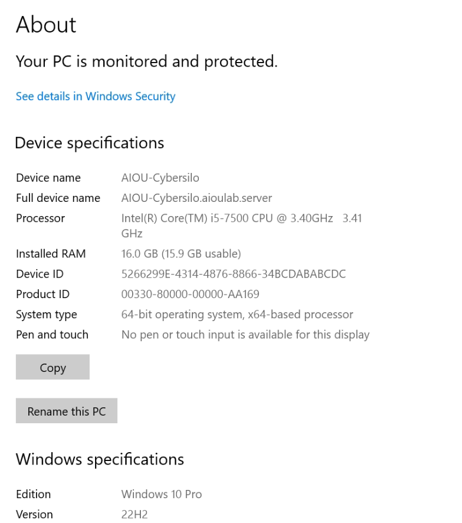

# Visual Evidence Summary

> **Quick reference guide mapping Windows Event ID screenshots to MITRE ATT&CK techniques and security significance.**

## 🎯 At-a-Glance Evidence Map

| Screenshot | Event ID | MITRE Technique | Security Category | Threat Significance |
|------------|----------|-----------------|-------------------|-------------------|
|  | **4624** | T1078, T1021.001 | Authentication | 🔶 Medium - Normal/Suspicious Logons |
|  | **4768** | T1558.003 | Authentication | 🔶 Medium - Kerberos TGT Requests |
|  | **4771** | T1110, T1558.003 | Authentication | 🔴 High - Failed Authentication |
|  | **4662** | T1087.002, T1069.002 | Directory Services | 🔶 Medium - Directory Enumeration |
|  | **4728** | T1098 | Account Management | 🔴 High - Global Group Changes |
|  | **4732** | T1098 | Account Management | 🔴 High - Local Group Changes |
|  | **4756** | T1098 | Account Management | 🔴 High - Universal Group Changes |
|  | **4720** | T1136.001 | Account Management | 🔴 High - Account Creation |
|  | **4726** | T1531 | Account Management | 🔴 High - Account Deletion |
|  | **4738** | T1098 | Account Management | 🔶 Medium - Account Modification |
|  | **4740** | T1110 | Authentication | 🔴 High - Brute Force Indicator |
|  | **N/A** | Environment | Infrastructure | 🔵 Info - Lab Configuration |

## 📊 Evidence Categories

### 🔐 Authentication Events (4 Screenshots)
- **Event 4624**: Successful logons - baseline for normal activity
- **Event 4768**: Kerberos TGT requests - potential Kerberoasting
- **Event 4771**: Failed Kerberos authentication - password attacks
- **Event 4740**: Account lockouts - brute force confirmation

### 👥 Account Management Events (5 Screenshots)
- **Event 4720**: New user accounts - unauthorized provisioning
- **Event 4726**: Deleted accounts - evidence destruction
- **Event 4728**: Global group changes - domain privilege escalation
- **Event 4732**: Local group changes - workstation compromise
- **Event 4756**: Universal group changes - cross-domain privileges

### 🗂️ Directory Services Events (1 Screenshot)
- **Event 4662**: Object access operations - reconnaissance activities

### 🖥️ Infrastructure Context (1 Screenshot)
- **Endpoint Configuration**: Domain-joined workstation evidence

## 🔍 Security Monitoring Value

### Immediate Detection Opportunities
- **Brute Force Attacks**: Events 4771, 4740
- **Privilege Escalation**: Events 4728, 4732, 4756
- **Account Manipulation**: Events 4720, 4726, 4738
- **Reconnaissance**: Event 4662

### Baseline Development
- **Normal Patterns**: Event 4624 for typical authentication
- **Administrative Activity**: Group management events for change tracking
- **User Lifecycle**: Account creation/deletion for provisioning audits

### Threat Hunting Applications
- **Kerberoasting Detection**: Event 4768 patterns
- **Lateral Movement**: Event 4624 cross-system correlation
- **Insider Threats**: Account management event sequences
- **Advanced Persistent Threats**: Multi-event correlation patterns

## 🛡️ Defensive Applications

### SIEM Rule Development
1. **High-Priority Alerts**: Events 4740, 4728, 4732, 4756, 4720, 4726
2. **Medium-Priority Alerts**: Events 4771, 4662, 4738
3. **Baseline Monitoring**: Event 4624, 4768

### Compliance Evidence
- **Account Management Auditing**: Complete user/group lifecycle
- **Authentication Logging**: Comprehensive logon event capture
- **Privileged Access Monitoring**: Administrative action documentation

### Training Material
- **Real-World Examples**: Actual event structures and content
- **Visual Learning**: Screenshot-based security awareness
- **Investigation Templates**: Event correlation methodologies

---

## 📁 Quick Navigation

- **[Complete Event ID Showcase](Event-ID-Showcase.md)** - Detailed analysis of all events
- **[Screenshots Directory](../Screenshots/README.md)** - Full screenshot catalog
- **[TTP Event Mapping](TTP-Event-Mapping.md)** - Technical MITRE mapping
- **[Main Project README](../README.md)** - Project overview

---

**Summary**: 12 distinct pieces of visual evidence covering authentication, account management, directory services, and infrastructure context. Complete coverage of critical Windows security events with direct MITRE ATT&CK technique mapping. 